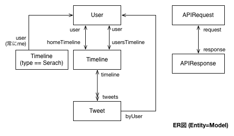

LTAPIRequest
=========

RESTful な API を持つ Web サービス用クライアント型iOSアプリのひな形

## 目的

LTAPIRequest は**クライアントアプリ**でよく使われるだろうモデルとネットワークリクエストのための
**ベースクラス** (`LTModel`, `LTAPIRequest`, `LTAPIResponse`)を提供します。

フレームワークとしてのフル機能ではなく、クライアントアプリを作成するための最低限の枠組み、
パターン、ひな形、実装方法、TIPS を提供します。

そのため、フルスタックのモデルフレームワークのようにすぐに使えるような機能がすべて揃ったものではありませんし、いくつかの部分はサブクラス化して自分で実装する必要があります。

全体的に薄い(Lightweightな)コード、程よい粗結合、1方向のデータの流れになっており、これらはデバッグを楽にしたり、コードを追いやすくしたりするようになっています。もちろん、iOS標準以外のライブラリに依存することはありません。

逆にフルスタックのフレームワークのように、使いこなすために膨大なドキュメントを読んだり、問題解決のために元のフレームワークのコードを追わないといけないということもありません。

基本的に LTAPIRequest は [Arch Way](https://wiki.archlinux.org/index.php/The_Arch_Way_%28%E6%97%A5%E6%9C%AC%E8%AA%9E%29) , [v2.0](https://wiki.archlinux.org/index.php/The_Arch_Way_v2.0_%28%E6%97%A5%E6%9C%AC%E8%AA%9E%29) の考え方を継承しています (ただし、作者は Arch を使っているとも限りませんが)。
下で述べる問題があったり、この考え方が自分に合わない場合は NSRails や RestKit などのフルスタックのフレームワークを使うことをおすすめします。

APIの種類や認証方法、その他の場合によっては、**ベースクラス**自体を変更する必要があるかもしれませんが、完全なライブラリよりも実装方法を提供するのが目的であるため、必要に応じて拡張してもかまいません。

だだし、これ以上ベースクラスが複雑になるような場合は、そもそも作ろうとしているアプリがこのパターンに当てはまらないか、アプリの機能(要求定義)がiOSで提供すべきものとしては著しく大きい可能性があります。
また、Web側のAPIとの組み合わせがうまくいかない場合は、Web側がRESTfulなAPIとして設計されていないか、アプリ側の設計が正しくない場合があります。

## 実装例 1

同梱されている、 `LTTwDemo` は Twitter の RESTful API を使った、Twitter クライアントです。それぞれの実装例と**ベースクラス**両方のコードを追いながら読むとよいと思います。
アプリを作るためには、実装例にあるように、**ベースクラス**以外にベースクラスを継承した Model, View, ViewController が必要になります。

iOSアプリの MVC については、参考書または [Cocoa iOS デザインパターン](http://yusukeito.me/post/41267296089/cocoa-ios) を参照してください。

### Model と Request を実装する

DEという接頭辞が付いたものが、Model と Request を継承して実装したものです。
Model は `DEUser`, `DETimeline`, `DETweet` があります。Request は `DEAPIRequest`, `DEAPIResponse` です。

設計した Model は以下のような関係を持ちます。CoreData の ER 図と同じような書き方です。

Twitter のサービス自体、ユーザーがホームタイムラインとユーザー自身のユーザータイムラインを持ちます。
各タイムラインには複数個のツイートを含みます。

実際に Twitter REST API 1.1 もこのモデルと同じような設計になっています。

これはオーナシップ図で、メモリ参照(インスタンスの参照)的に親と子の関係を示しています。
`[User me]`, `modelWithID:` で DEUser を static 変数としてアプリ内にグローバルに持ちます。

それ以下に DETimeline や DETweet を含みます。DETweet から親である DETimeline を参照するための `DETweet.timeline` というインスタンス変数を持ちますが、これは循環参照を避けるために weak にする必要があります。

また、リクエスト系のクラスに関してはリクエストを送信して、受信している時のみiOS(Operation Queue)が、DEAPIRequest のオーナーになります。

リクエストが終わると、コールバック(completionHandler, callback)が発行されて、スコープから抜けると、不要になったRequestは解放されます。
1リクエストごとに1インスタンスとなります。

### ViewController を実装する

ViewController のコアの実装はとてもシンプルですし、このようにシンプルにするべきです。Timeline を表示する `TimelineViewController` があります。
これは Model, DETimeline をセットすると、この ViewController がこのモデルのデータを取得、表示します。

基本的にはデータを取得するために DETimeline の `-refreshWithCallback:` と `-loadMoreWithCallback:` を呼ぶだけです。2重送信を避けるためにフラグを立てておくべきです。

リクエストに成功すると DETimeline の `tweets` に取得したツイートを追加して、成功か失敗か(`success`)と追加された行の IndexSet を返します。
また、この Callback はリクエストが終わったとに APIRequest と同時に解放されるので、weak self などのメモリ管理は必要ありません。

## 実装例2

`DETodo` は クラウドで同期できる簡単な TODO アプリです。
(_デモを作ってから思ったのですが、ToDoアプリはWebサービスのクライアントというよりは同期型のほうがいいですね。Model åのラッパーを作れば同期型にすることも可能です。_)

[Server側](DETodo/Server.md)の説明と[APIドキュメント](DETodo/api_document.md)も合わせて参照してください。

上の例と同じく、内部的な Model の関係は以下のようになります。
User は自分(認証されたユーザー)のみです。

また、それぞれの Model が対応する API のパスは図の右のようになります。

ViewController は Twitter の場合と変わりませんので、ソースコード内のコメントを参照してください。

サーバサイドとして、本番で使う API のサーバー(`detodo-server`)以外にも、`test-server-node` というAPIのテスト用のサーバーを作成しました。これは、iOS 側の API 呼び出しが正しいかどうかを確かめるものです。また、各種ステータスコードのテストやレスポンスが極端に遅い場合、レスポンスが返らない場合などがテストできます。test-server-node/app.js のコメントも参照してください。

## キャッシュと永続化

## ライセンス

コード: [Apache License 2.0](http://www.apache.org/licenses/LICENSE-2.0.txt), 文書: [CC BY 2.1](http://creativecommons.org/licenses/by/2.1/jp/)

